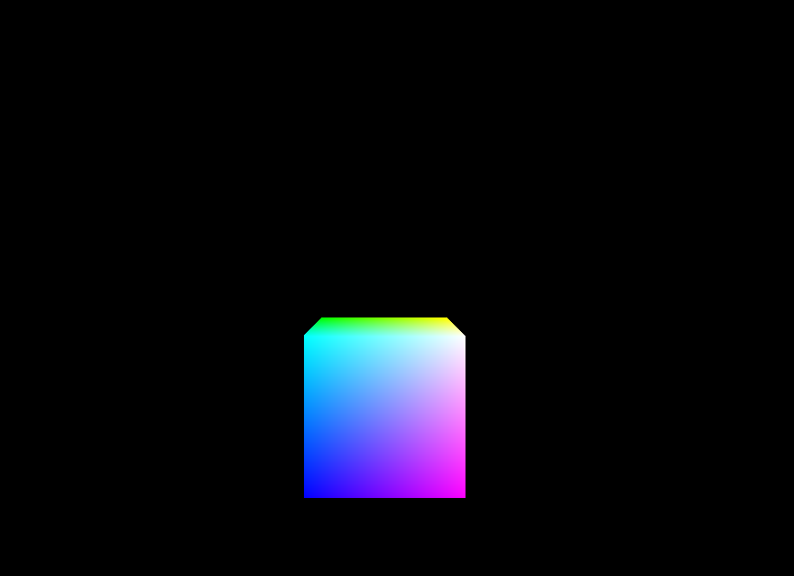
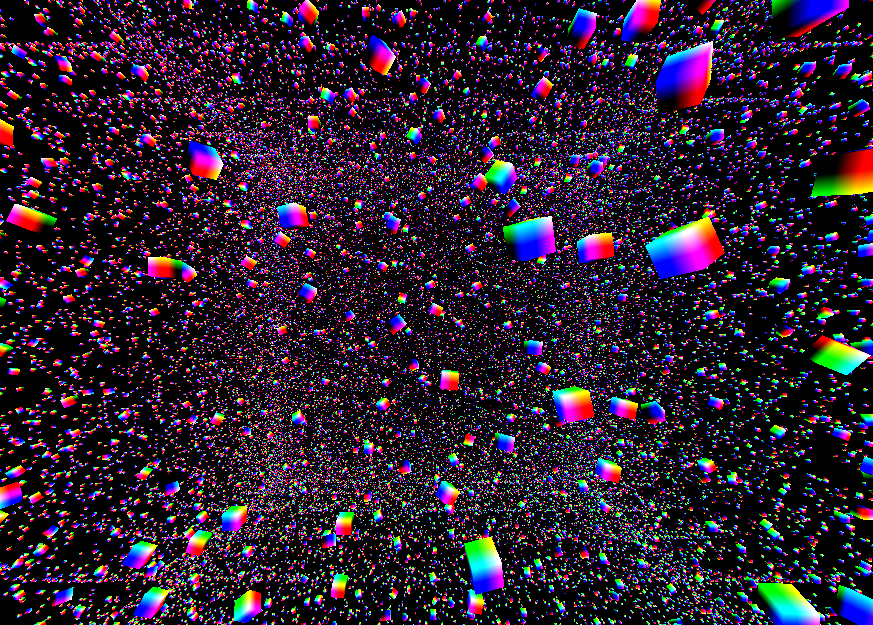
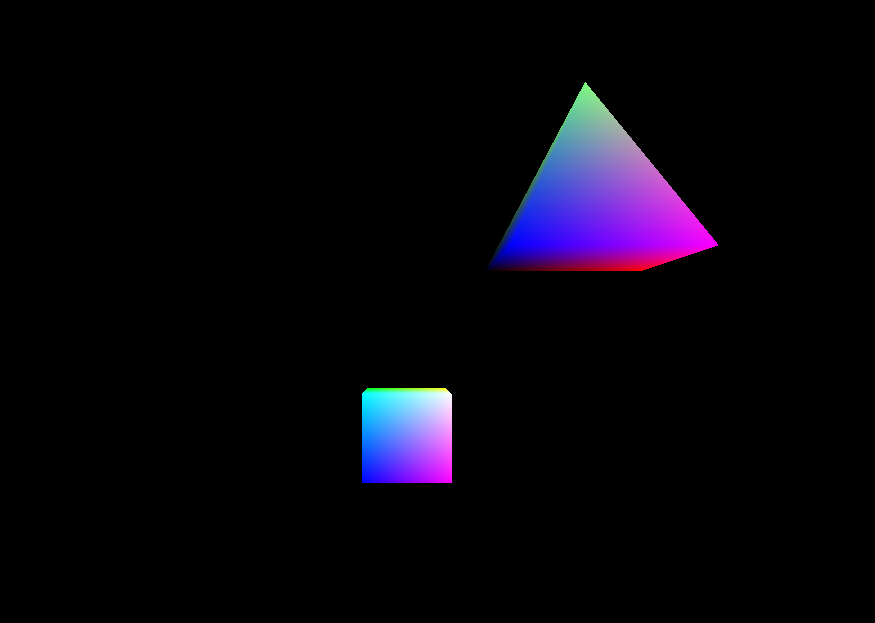
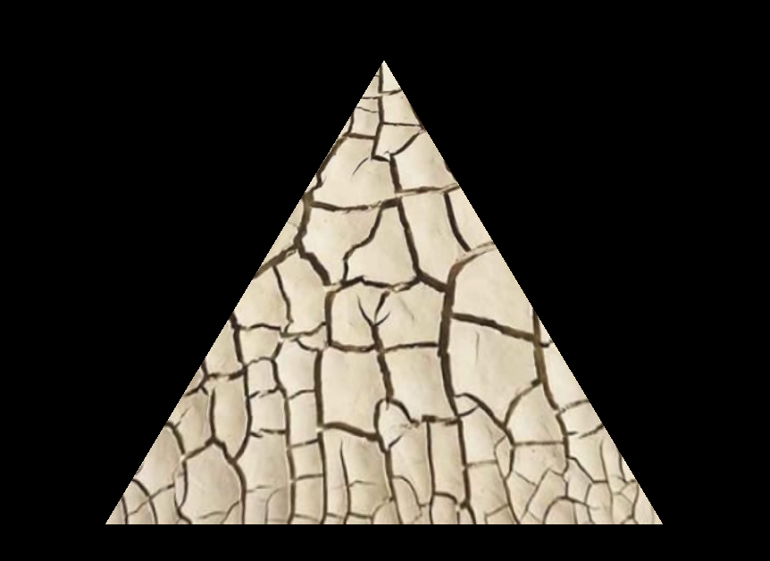
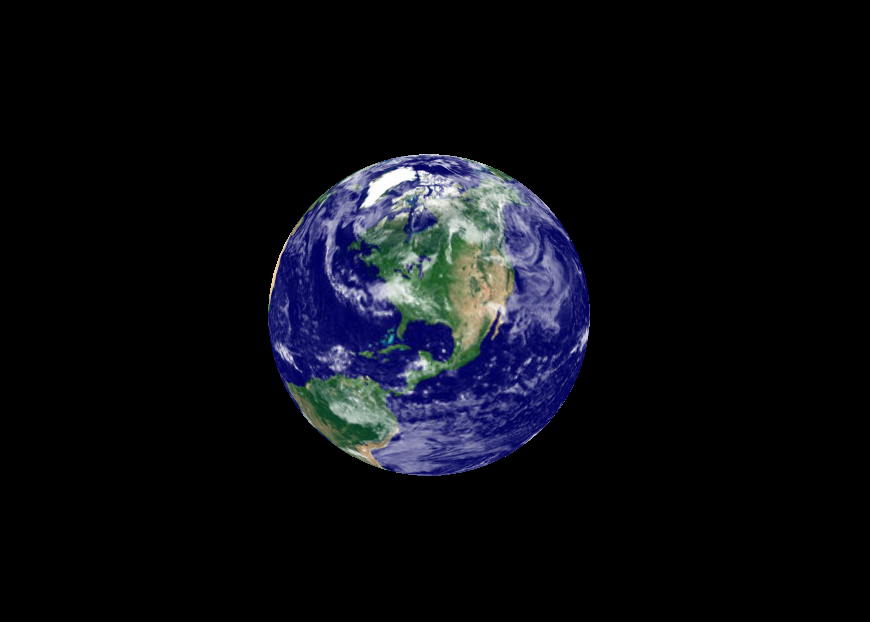

# Computer Graphics Programing in Opengl with c++ 
Since there is no official repository with the book's program code, I took it upon myself to create this repository to help the book's readers access the code quickly and easily. 

---------
## Build & Run
**dependencies.**
- OpenGl
- glfw3
- glm
- SOIL2

1. clone the repository.
```sh
git clone git@github.com:Nobody-1321/Computer-Graphics-Programing-in-Opengl-With-C.git
```
2. Move to the directory GRAPHICS
```sh
mkdir build
cd build
cmake ..
make
```

This will build the project and compile all the programs located within the src folder. If you don't want to compile all the programs, you can comment out the foreach block in the CMakeLists.txt file and create an executable for the specific program you are interested in compiling, keep in mind that you must specify the correct path to the GLS files or any other files necessary for the program's execution.

---------------------------









---------------------------
#### You can learn more about computer graphics by reading Computer Graphics Programming in OpenGL with C++, Third Edition by V. Scott Gordon and John Clevenger.


