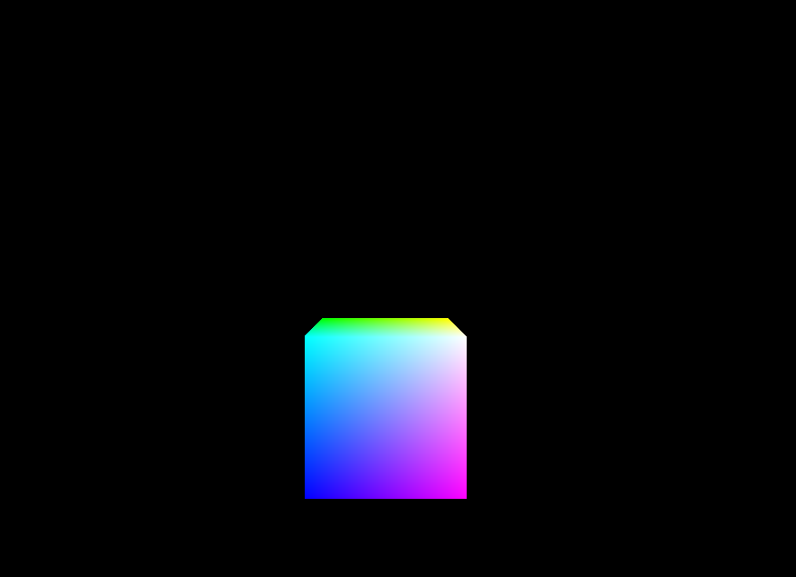
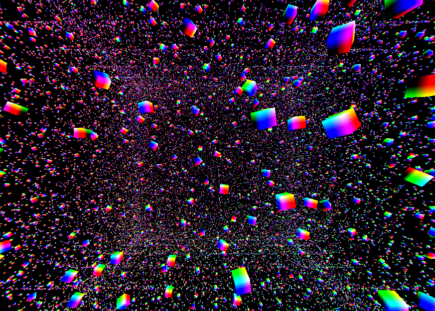
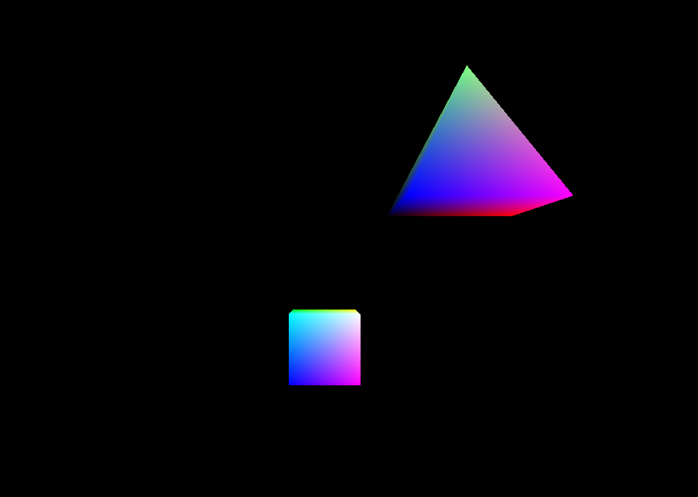
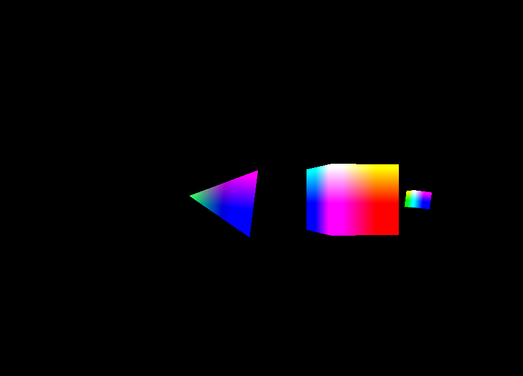
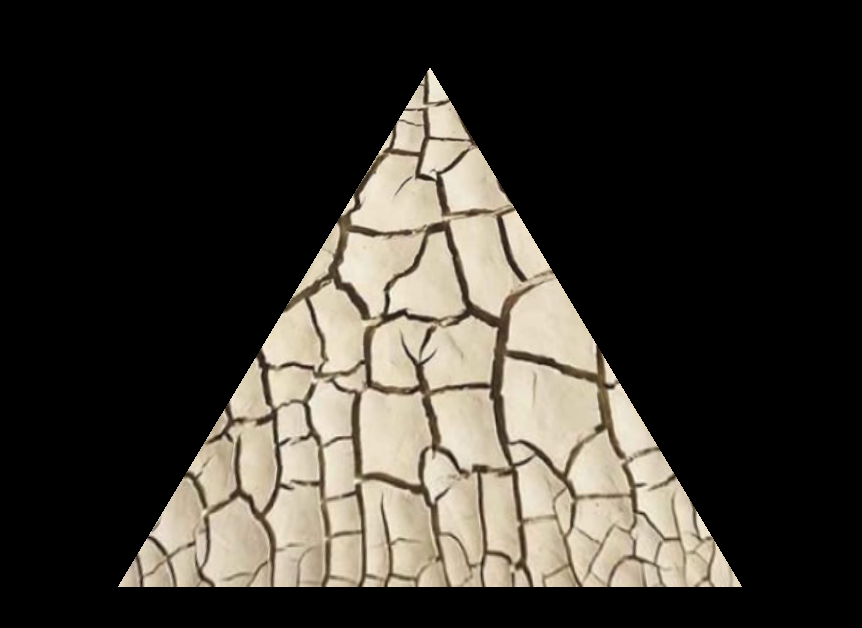
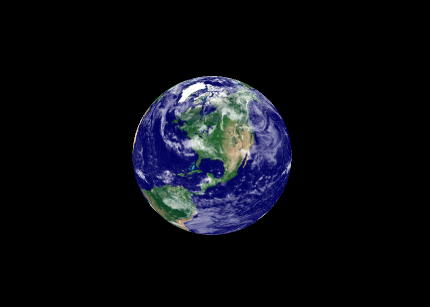
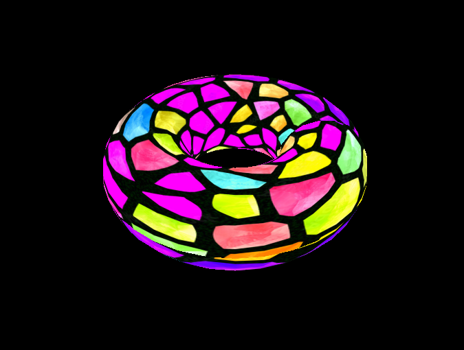
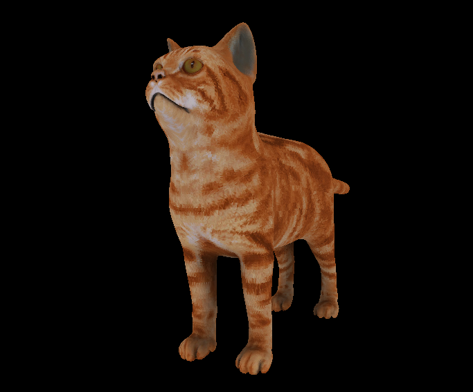
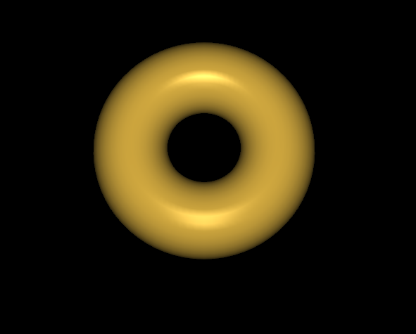
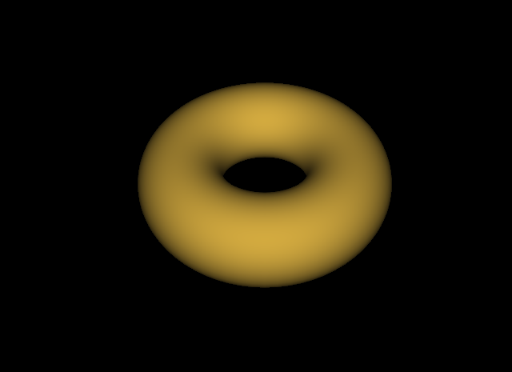

# Computer Graphics Programing in Opengl with c++ 
Since there is no official repository with the book's program code, I took it upon myself to create this repository to help the book's readers access the code quickly and easily. 

---------
## Build & Run
**dependencies.**
- OpenGl
- glfw3
- glm
- SOIL2

1. clone the repository.
```sh
git clone git@github.com:Nobody-1321/Computer-Graphics-Programing-in-Opengl-With-C.git
```
2. Move to the directory GRAPHICS
```sh
mkdir build
cd build
cmake ..
make
```

This will build the project and compile all the programs located inside the src folder. If you do not want to compile all programs, you can use -DOPTION=OFF and specify inside the CMakeLists.txt file the program you want to compile and specify the files needed to run the program.

---------------------------
# Programs Gallery

<table>
  <tr>
    <td>
      
    </td>
    <td>
      
    </td>
  </tr>
</table>

<table>
  <tr>
    <td>
      
    </td>
    <td>
      
    </td>
  </tr>
</table>

<table>
  <tr>
    <td>
      
    </td>
    <td>
      
    </td>
  </tr>
</table>

<table>
  <tr>
    <td>
      
    </td>
    <td>
      
    </td>    
  </tr>
</table>

<table>
  <tr>
    <td>
      
    </td>
    <td>
      
    </td>    
  </tr>
</table>

<table>
  <tr>
    <td>
      
    </td>
    <td>
      
    </td>    
  </tr>
</table>

---------------------------
#### You can learn more about computer graphics by reading Computer Graphics Programming in OpenGL with C++, Third Edition by V. Scott Gordon and John Clevenger.


