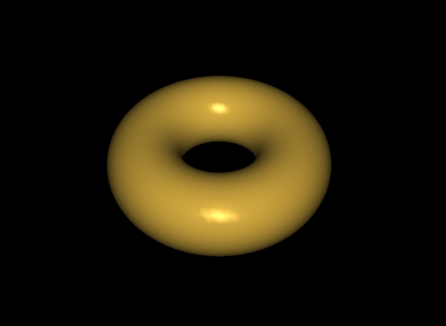
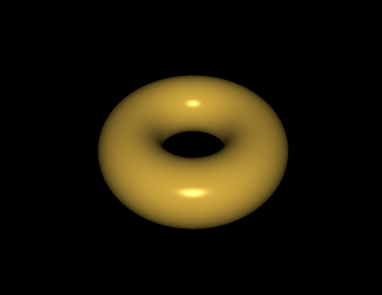
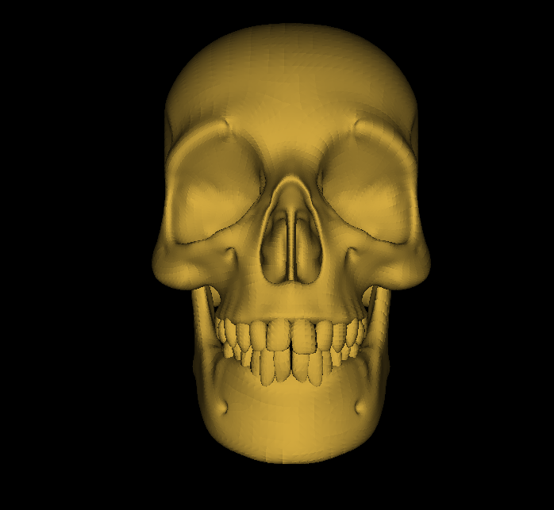

# Computer Graphics Programming in Opengl with c++ 
Computer Graphics Programming in OpenGL with C++. Since there is no official repository with the book's program code, I took it upon myself to create this repository to help the book's readers access the code quickly and easily. 

---------
## Build & Run
**dependencies.**
- OpenGl
- glfw3
- glm

1. clone the repository.
```sh
git clone git@github.com:Nobody-1321/Computer-Graphics-Programing-in-Opengl-With-C.git
```
2. Move to the directory 
```sh
cd Computer-Graphics-Programing-in-Opengl-With-C
```

3. Use conan C++ to manage the dependencies. "you can learn how to use it here [conan tutorial](https://docs.conan.io/2/tutorial.html)" 

```sh
conan install . --build=missing 
```
4. Build the project.

Linux users

```sh
python buildLinux.py
```

Windows users

```sh
python buildWindows.py
```

## warning 
If you are a Windows user, you may need to change the paths to the ressources in the code.


Computer Graphics Programming in OpenGl with C++. This will build the project and compile all the programs located inside the src folder. more information about the programs can be found in the wiki. 

---------------------------
# Programs Gallery

<table>
  <tr>
    <td>
      
    </td>
  </tr>
</table>

<table>
  <tr>
    <td>
      
    </td>
    <td>
      
    </td>
  </tr>
</table>

<table>
  <tr>
    <td>
      
    </td>
    <td>
      
    </td>
  </tr>
</table>

<table>
  <tr>
    <td>
      
    </td>
    <td>
      
    </td>    
  </tr>
</table>

<table>
  <tr>
    <td>
      
    </td>
    <td>
      
    </td>    
  </tr>
</table>

<table>
  <tr>
    <td>
      
    </td>
    <td>
      
    </td>    
  </tr>
</table>

<table>
  <tr>
    <td>
      
    </td>
    <td>
      
    </td>    
  </tr>
</table>

<table>
  <tr>
    <td>
      
    </td>
    <td>
      
    </td>    
  </tr>
</table>


---------------------------
#### You can learn more about computer graphics by reading Computer Graphics Programming in OpenGL with C++, Third Edition by V. Scott Gordon and John Clevenger.


